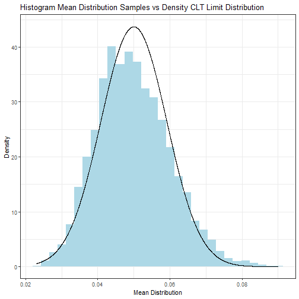
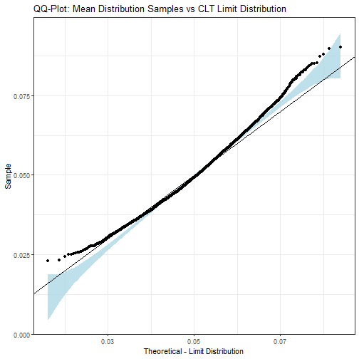

Illustrations for the Central Limit Theorem
========================================================
author: Daniel Morales
date: 2020-08-25
autosize: true

What is this app about?
========================================================

Have you ever wanted to see the Central Limit Theorem in action? It is an 
asymptotic result that tells us about the distribution of the mean
of a sequence of n independent and identically distributed (i.i.d.) random 
variables drawn from a distribution with given expected value &mu; and finite 
variance &sigma;&sup2;: for large n (or as n &rarr; &infin;), we have 
X&#772;n &sim; N(&mu;, &sigma;&sup2; / n)

It is a powerful and general result that we can use to build confidence 
intervals, for example. But the theorem does not answer an important question 
for us to use this result, that is

**How large should n be?**

How large should n be?
========================================================

That is the question we are investigating in this application, mainly due to a 
rule of thumb present in statistics, where it is said that n = 30 is good 
enough. Now you have a simple app to test that for some distributions:

- Firstly, you select a distribution to draw samples from;

- Then, according to the distribution chosen, you can select its parameters;

- Now it is time select n under "Sample Size - Chosen Distribution";

- The last input, "Mean Distribution Samples", is the real trick for our investigation: we are having this number of samples from the mean distribution 
in order to plot our graphs.

Histogram vs Density
========================================================

----

- More visual impact;

- Compares a histogram from the samples of the mean distribution with the 
density of the asymptotic normal distribution;

- Created with 5000 samples of the distribution of the mean of 25 i.i.d. 
random variables exponential with rate parameter 20;

- Try reproducing it!

Q-Q Plot
========================================================

----

- More useful to analyse the fit and the convergence;

- Quantile-quantile plot with the same comparison from before;

- Created with 5000 samples of the distribution of the mean of 25 i.i.d. 
random variables exponential with rate parameter 20;

- Try reproducing it!
